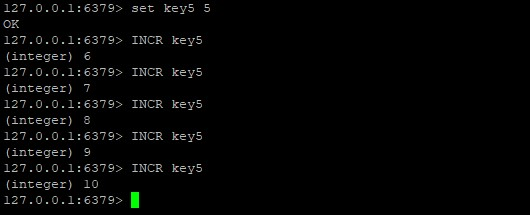

# Домашнее задание к занятию «Кеширование Redis/memcached» - Михалёв Сергей
---
### Задание 1. Кеширование 

Приведите примеры проблем, которые может решить кеширование. 

**Решение:** *Основная проблема, решаемая Кешированием- общая производительность системы и уменьшение нагрузки* 
- *Ускорение получения веб-контента от веб-сайтов (браузеры или устройства)*
- *Определение IP-адреса для домена (DNS)*
- *Ускорение получения веб-контента от серверов веб-приложений Управление веб-сеансами (на стороне сервера)*
- *Повышение производительности приложений и ускорение доступа к данным*
- *Сокращение задержек, связанных с запросами к базе данных*
 

---

### Задание 2. Memcached

Установите и запустите memcached.

*Приведите скриншот systemctl status memcached, где будет видно, что memcached запущен.*

**Решение:**

- скриншот systemctl status
  * 

---

### Задание 3. Удаление по TTL в Memcached

Запишите в memcached несколько ключей с любыми именами и значениями, для которых выставлен TTL 5. 

*Приведите скриншот, на котором видно, что спустя 5 секунд ключи удалились из базы.*

**Решение:**
- *Написал [скрипт](./memcache.py) на Python:*

- скриншот выполнения скрипта
  * 

---

### Задание 4. Запись данных в Redis

Запишите в Redis несколько ключей с любыми именами и значениями. 

*Через redis-cli достаньте все записанные ключи и значения из базы, приведите скриншот этой операции.*

**Решение:**
- скриншот записи и получения ключей
  * 

## Дополнительные задания (со звёздочкой*)
Эти задания дополнительные, то есть не обязательные к выполнению, и никак не повлияют на получение вами зачёта по этому домашнему заданию. Вы можете их выполнить, если хотите глубже разобраться в материале.

### Задание 5*. Работа с числами 

Запишите в Redis ключ key5 со значением типа "int" равным числу 5. Увеличьте его на 5, чтобы в итоге в значении лежало число 10.  

*Приведите скриншот, где будут проделаны все операции и будет видно, что значение key5 стало равно 10.*

**Решение:**
*Для увеличения значения ключа использовал метод INCR*
- скриншот проделанной работы
  * 

_Made on Raspberry Pi_ ;)
